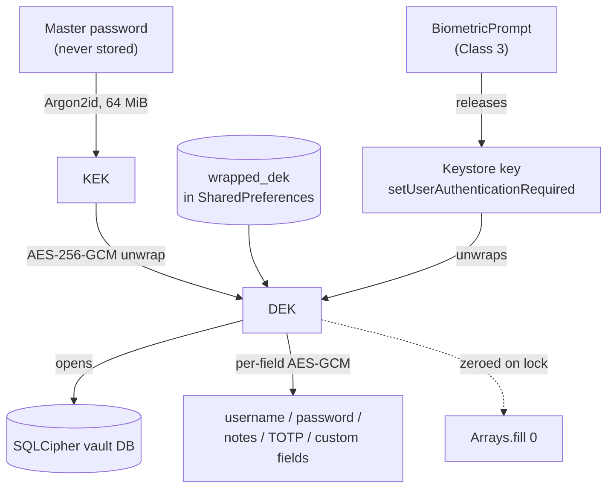
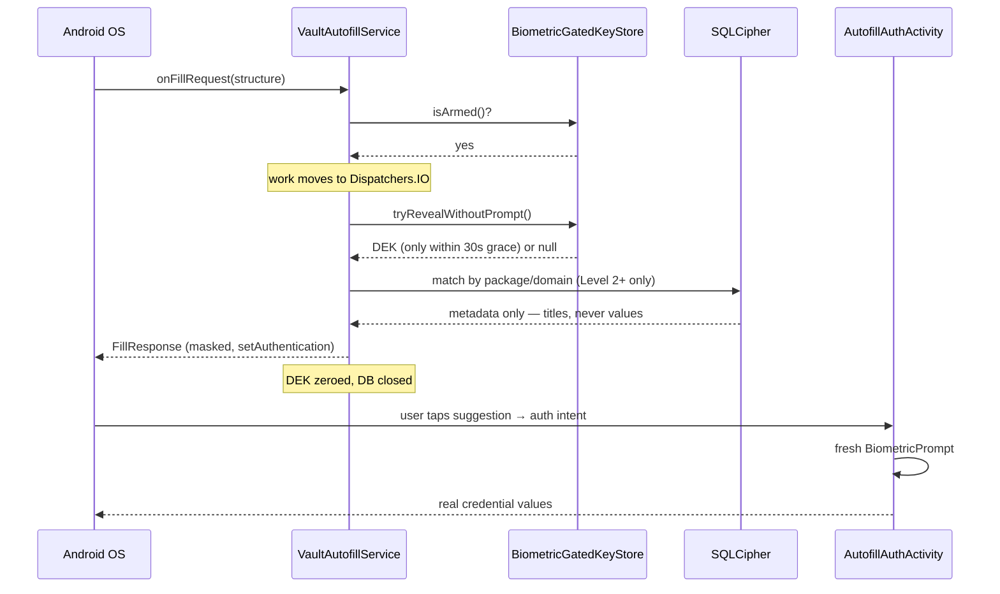
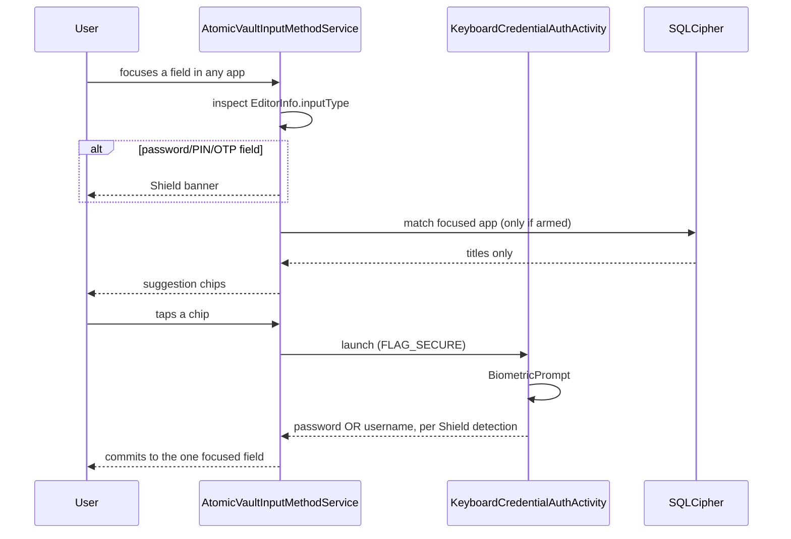
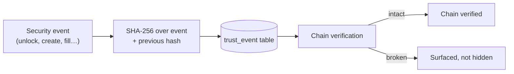

# AtomicVault — Full Project Audit

**Scope:** all 59 Kotlin source files, Gradle config, manifest, CI workflow.
**Method:** static review only. No Android SDK, emulator, or device was reachable in this environment, so nothing below was compiled or run — see §6.

---

## 1. Fixes applied this round

### P0 — Autofill service ran SQLCipher + crypto on the main thread
**Files:** `autofill/VaultAutofillService.kt`

`onFillRequest()` and `onSaveRequest()` are platform callbacks delivered on the service's main thread. Both opened a SQLCipher connection, ran credential-matching queries, and decrypted fields **synchronously inside the callback**. On a loaded device or a large vault this stalls the frame of whatever *other* app the user is typing in, and risks the OS treating the autofill response as an ANR.

Both callbacks are explicitly designed for async completion — that's the entire purpose of `FillCallback`/`SaveCallback`. Moved the work to a service-scoped `CoroutineScope(Dispatchers.IO + SupervisorJob())`, cancelled in `onDestroy()`. The `dek` zeroing and `db?.close()` in the `finally` blocks were preserved exactly; nothing about the security model changed, only which thread it runs on.

### P0 — Full-vault decryption on the main thread
**Files:** `ui/VaultViewModel.kt`, `ui/security/SecurityDashboardScreen.kt`, `ui/NavGraph.kt`

`getAllCredentialsForSecurity()` calls `exportData()`, which is an N+1 read — one query for IDs, then per item another query for the row, another for custom fields, another for tags, plus an AES-GCM open per encrypted field. This is the heaviest read in the app, and the Security Dashboard invoked it from `LaunchedEffect(Unit)`, which runs on the **main** dispatcher.

Made it `suspend` with `withContext(Dispatchers.IO)`. Changed the screen's callback type to `suspend () -> List<CredentialPlain>` so the compiler now enforces this. The "Re-scan vault" button added earlier launches through a `rememberCoroutineScope()`.

### P0 — Credential loads blocking composition
**Files:** `ui/VaultViewModel.kt`, `ui/editor/CredentialEditorScreen.kt`, `ui/NavGraph.kt`

`viewModel.getItem(id)` did a SQLCipher read plus 4+ AES-GCM decryptions synchronously. It was called three ways, all on the main thread — and two of them (`remember(itemId) { viewModel.getItem(it) }` for the Payment Card and Identity editors) ran it **inside composition itself**, blocking the frame that opens the screen.

`getItem()` is now `suspend`. Both `remember { }` call sites became `produceState`. `CredentialEditorScreen.onLoadItem` is now a `suspend` lambda (it was already called from a `LaunchedEffect`, so no structural change there). Making these suspend rather than adding parallel async variants is deliberate: it removes the footgun instead of leaving it available.

### P2 — Vault state only half-cleared on lock
**File:** `ui/VaultViewModel.kt`

`lockVault()` cleared `previews`, `folders`, `query`, and `folderFilter` — but left `tags`, `tagFilter`, and `settings` populated. Nothing there is a decrypted secret (tag names are stored plaintext by design), but a locked vault shouldn't still be holding real vault contents in UI state. Now cleared with the rest.

---

## 2. Verified correct — no change needed

Worth recording, because several of these are the kind of thing that *looks* like a bug until you check:

- **No logging anywhere.** Zero `Log.*`, `println`, or `print` calls in the entire source tree. For a credential manager this is the right answer and it's genuinely clean.
- **No coroutine anti-patterns.** No `GlobalScope`, no `runBlocking`, no `Thread.sleep`.
- **DEK zeroing is consistent.** `Arrays.fill(dek, 0)` appears in every path that obtains one — unlock failure, lock, autofill fill, autofill save (including the early-return branch), and the KEK is zeroed immediately after unwrapping rather than at end of scope.
- **`BiometricGatedKeyStore` is architecturally sound.** `setUserAuthenticationRequired(true)` means the *Keystore* enforces auth, not app call-ordering. `KeyPermanentlyInvalidatedException` is caught in both `beginReveal()` and `tryRevealWithoutPrompt()` and calls `clear()` to fail closed. `tryRevealWithoutPrompt()`'s 30-second grace window is documented, bounded, and only used for metadata matching — actual value reveal always goes through a fresh `BiometricPrompt`.
- **DB indices back real queries.** Every index in `Ddl.kt` maps to an actual query pattern, including the reverse `credential_tag(tag_id)` lookup the composite PK doesn't serve.
- **`FLAG_SECURE` is state-driven**, applied via `repeatOnLifecycle(STARTED)` with a change-guard so it isn't reset every emission.
- **Lazy lists use stable keys** (`key = { it.id }`) in both the credential list and the findings list.
- **Clipboard clear is correctly conditional** — it only wipes if the clipboard still contains the value it wrote, so it won't destroy something the user copied afterward. Sets `EXTRA_IS_SENSITIVE` on Android 13+.
- **Autofill save de-duplicates** rather than blindly inserting, using the same Level-2 trust threshold as fill-time offering.

---

## 3. Open findings — flagged, not changed

These need a product decision, so I didn't act unilaterally:

**a) Auto-lock is background-only.** `VaultLifecycleObserver.onUserActivity()` is wired to `MainActivity.onUserInteraction()`, but it only calls `handler.removeCallbacks(...)` — and no lock is ever *scheduled* while the app is foregrounded. So the hook is effectively dead code in the foreground, and a vault left open on-screen never auto-locks. `MainActivity`'s comment says "re-locks if backgrounded > 60s", so this may well be intended. But the Settings label just says "Auto-Lock Timeout" with 1/5/15-minute options, which most users would read as covering idle time too. Either add a foreground idle timer or reword the setting — both are small, but they're different products.

**b) `exportData()`'s N+1 is inherent, not incidental.** Now off the main thread, so it's no longer a jank risk, but a 500-item vault still issues ~1,500 queries for one dashboard scan. Worth batching into a JOIN-based read if vault sizes grow. Not urgent at typical sizes.

**c) Dead branch:** `ClipboardHelper` checks `SDK_INT >= P` (28), but `minSdk` is already 28 — always true. Harmless, one-line cleanup whenever you're in there.

**d) Kotlin packages are still `com.example.*`** while `applicationId`/`namespace` are correctly `com.atomicvault.android`. Functionally irrelevant (Kotlin package ≠ Gradle namespace) and renaming mid-flight is exactly the "mass package rename" the original brief warned against. Noting it so it's a decision, not an oversight.

---

## 4. Integration data-flow diagrams

### 4.1 Key hierarchy — how the vault actually opens

The master password never reaches disk in any form; only the Argon2id-derived KEK's *output* (the wrapped DEK) is persisted. The biometric path is a parallel unwrap of the same DEK via a hardware-gated Keystore key — not a stored password.

### 4.2 Autofill fill request

The critical property: **the fill response never carries a credential value.** Metadata matching and value reveal are separate steps with separate auth requirements.

### 4.3 Keyboard (IME) reveal

Structural limitation worth knowing: the IME only ever sees **one focused field at a time**, so unlike Autofill it can't fill a username+password pair in a single action.

### 4.4 Trust ledger

Subject references and target packages are stored **hashed**, not in the clear, and no keystroke-level events exist in the `TrustEventType` enum at all.

---

## 5. Architecture notes

- **Single source of truth:** one `VaultViewModel` owns `activeDb`, `activeDek`, and `repository`. Every screen is stateless w.r.t. vault data and receives it via `uiState`. No competing caches.
- **Connection lifetime is deliberately split:** the ViewModel holds one long-lived connection for the unlocked session (closed in `lockVault()`); the autofill service opens short-lived per-request connections (closed in `finally`). Both are correct for their context, and the code comments say why.
- **One auth manager, not several.** `BiometricGatedKeyStore` is shared by app unlock, autofill, and keyboard reveal — same process, same UID, one Keystore alias.

---

## 6. What was not done

No build, no lint, no tests, no install, no device run — no Android toolchain was reachable here. Everything above is static analysis and reasoning about the code as written. The edits are syntactically balanced and imports were checked by hand, but **the first CI run is the real verification**, and the P0 fixes touch threading in a system service, which is exactly the class of change that deserves a real device test before shipping. The build will tell you fast if I got a suspend signature wrong.
